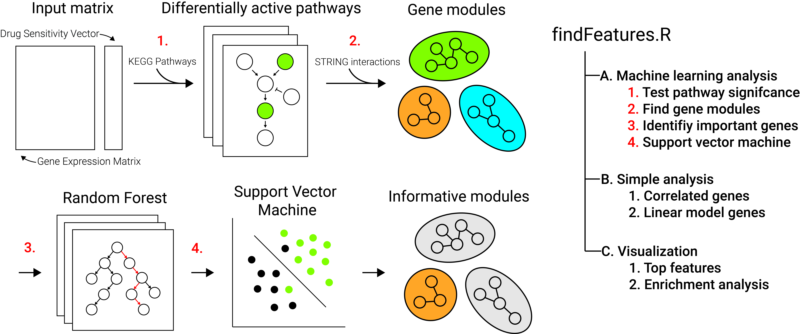

# Cancer drug machine learning analysis 

## Table of Contents

* [Overview](#overview)
* [Drug analysis](#drug-analysis)
* [Additional analysis](#additional-analysis)
* [Contributors](#contributors)

## Overview
* Raw scripts/Pipeline for analysis performed in manuscript *Machine learning approach informs biology of cancer drug response*.
* Analysis can be replicated by script provided in folders named after each drug
* Scripts used to perform confirmatory analysis can be found in confirm folder

## Drug analysis
1. First download array expression data and place this file in the common_files folder. As of 4/17/2022, There's no live link to the file I used, so I uploaded it to dropbox. The file was orginally obtained from ftp://ftp.sanger.ac.uk/pub/project/cancerrxgene/releases/current_release/sanger1018_brainarray_ensemblgene_rma.txt.gz. 
	*  https://www.dropbox.com/s/63d664sknfh8iv3/sanger1018_brainarray_ensemblgene_rma.txt?dl=0
2. Run findFeatures.R to perform the analysis
	* This script is broken down into sections as depicted in the schematic given above. Section A performs the machine learning analysis, Section B performs the analysis using simple methods, and section C generates figures for the machine learning analysis.

## Additional analysis
1. Run analysis.R in confirm folder
	* This script will perform the exploratory and confirmatory analysis. Script is broken down into sections corresponding to figures 4-6.

## Contributors 
* Eliot Zhu
* https://github.com/eyzhu
